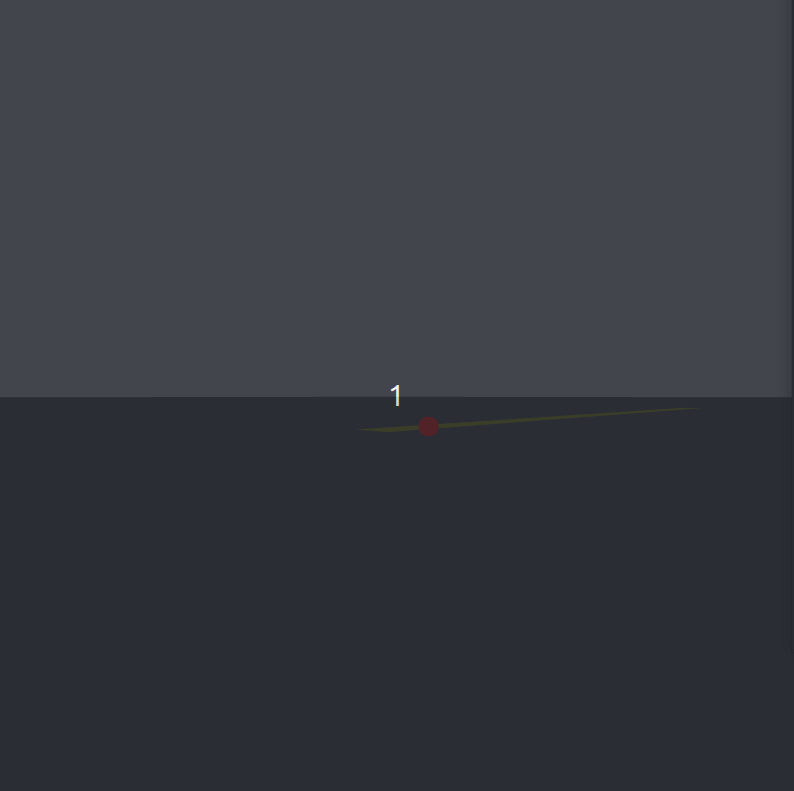
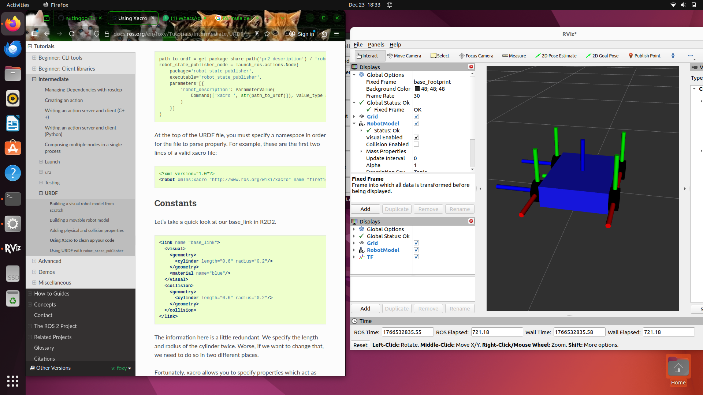
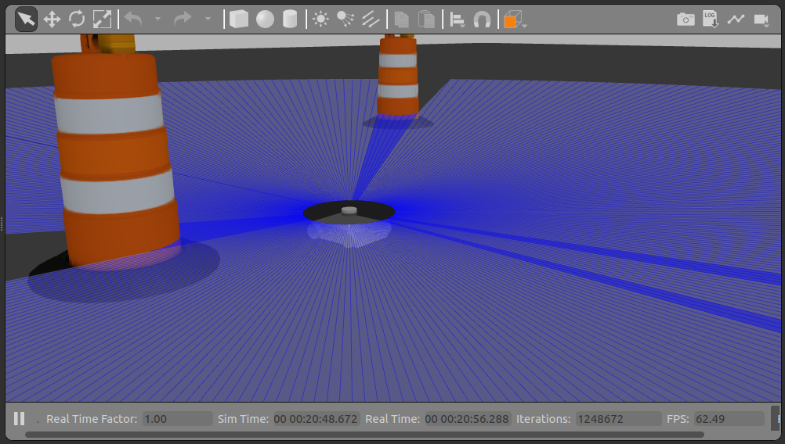

# Robot Autónomo con ROS 2 Humble

Este repositorio contiene el desarrollo de un robot móvil diferencial simulado en Gazebo, capaz de realizar navegación autónoma básica mediante visión artificial.
<p align="center">
  
</p>

###  Progreso del Proyecto

### 1: Fundamentos y Simulación
- Configuración del entorno de desarrollo (Ubuntu 22.04 + ROS 2 Humble).
- Creación de paquetes y estructura de workspace.
- **Simulación:** Lanzamiento de mundos básicos en Gazebo Classic.

### 2: Percepción y Control (Estado Actual)
- **Diseño URDF:** Robot con física realista, chasis y ruedas (Skid-Steer/Diferencial).
- **Sensores:** Integración de LIDAR (Rays) y Cámara RGB.
- **Visión Artificial:** Nodo de procesamiento de imágenes con OpenCV (Detección de carril amarillo).
- **Control:** Implementación de un controlador **PID** para seguimiento de línea autónomo.
<p align="center">
  
</p>
<p align="center">
  
</p>

## Cómo ejecutar la simulación - Usaremos 2 terminales en simultáneo

1. **Lanzar Gazebo con el Robot (Terminal 1)**
   ```bash
   cd ~/learning-robotics
   colcon build --packages-select my_bot_description
   source install/setup.bash
   ros2 launch my_bot_description sim_launch.py
   ```
2.  **Compilar la visión del robot (Terminal 2)**
   ```bash
   cd ~/learning-robotics
   colcon build --packages-select my_bot_vision
   source install/setup.bash
   # Añadimos 'linea_amarilla.sdf' a Gazebo
   ros2 run gazebo_ros spawn_entity.py -file src/my_bot_description/urdf/linea_amarilla.sdf -entity mi_linea_amarilla -x 2.0 -y 0.0 -z 0.0
   # Compilamos el movimiento autonomo
   ros2 run my_bot_vision detect_line
   ```
3. **Mueve el Robot en Gazebo**

En Gazebo, posiciona el robot de tal manera que esté a una distancia media de la línea amarilla y pueda verla, cuando la reconozca aparecerá una venta "Camara Original" con un punto rojo sobre la línea.
   Notas: El robot avanza lento porque esta es una prueba. Cuando el robot está sobre la línea amarilla este dejará de moverse pues llegó a su destino. Este proyecto está libre a comentarios, por favor indicar si encuentra alguna falla, gracias.
<p align="center">
  
</p>
